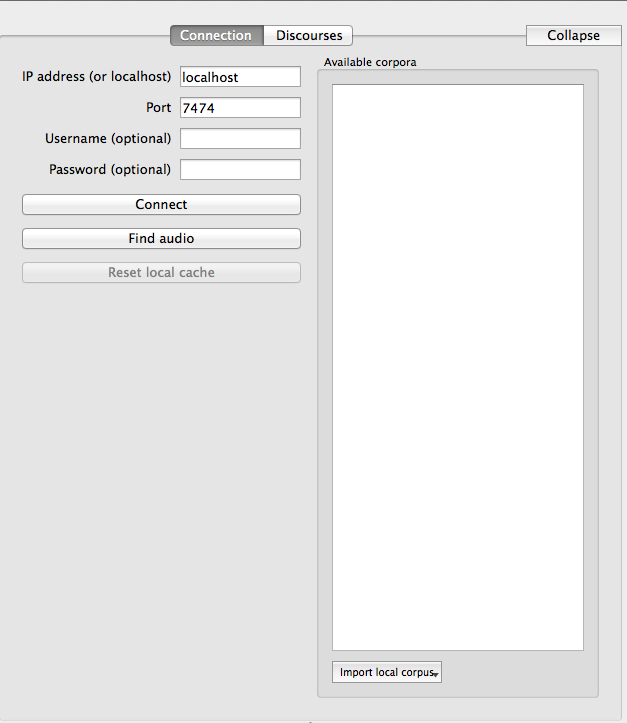
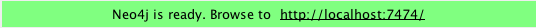
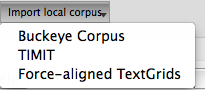

.. _exconnecting:

******************************
Example: Connecting to Servers
******************************

If you already have Neo4j open and started, you're ready to start connecting to servers.

Go to the upper right panel in SCT

You're not connected to the Neo4j graph database the first time you start the program. Let's fix that. Make sure that the port is the same as in your Neo4j window.

If they match, you're ready to proceed. Press connect. Because it is your first time using the program, nothing will appear in "Available Corpora", but the "Reset Local Cache" button should now be clickable. 

Next, go to "Import Local Corpus" at the bottom center and click on it.

Press "Buckeye Corpus". This was included with the tutorial. Go to the tutorial folder and select "buckeyeDataForTutorial". You will have to wait for the corpus to be imported. 

When the process has completed, you are ready to make some queries. Simply select the corpus by clicking on it under "Available corpora" and begin adding filters. 

