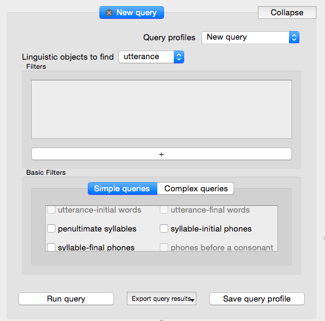
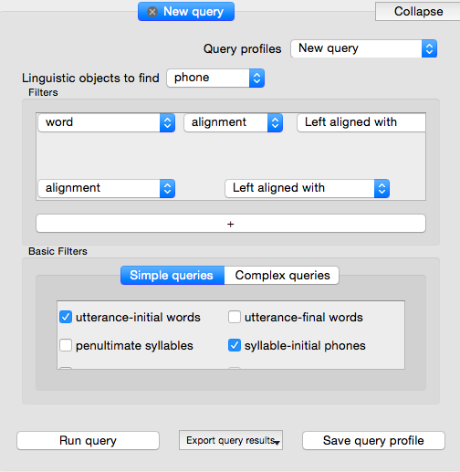
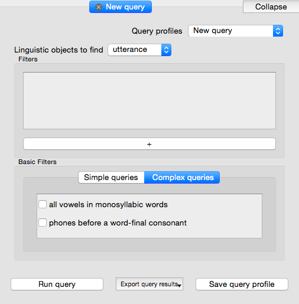
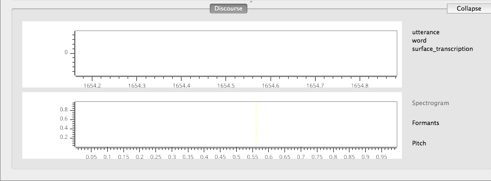
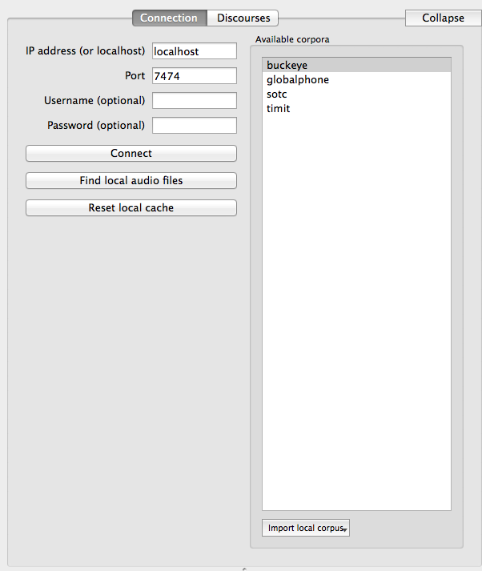

.. _tour:

*****************
Navigation Tour
*****************

This is a tour to get you familiarized with the SCT layout and its functions. This is the entire window
	
	.. image:: fullscreen.png
		:width: 799px
		:height: 474px
		:alt: Image cannot be displayed in your browser

The numbers of the panels surrounded by red rectangles correspond to:

Queries (1)
###########
In the upper left corner, you will find the query panel

You will begin by selecting a target type in the dropdown menu next to "Lingustic objects to find". 
You can add filters by pressing the long "+" bar at the bottom of the panel.
If you want to used a saved query, you can do so by selecting it from the dropdown menu on the top right of the panel.

Additionally, you can use premade templates that can be selected by checking them. Both simple queries and complex queries have been incorporated. Checking these boxes will add a fixed set of filters which correspond to that query:

 Some are only available through enrichment, and will become clickable once the prerequisite enrichment is completed (e.g. utterance-initial words is only available after utterances have been encoded). Note that there are more simple query options available than fit in the window, so scrolling may be necessary to view all of them.

Complex queries generally consist of more filters and can be checked and run just like simple queries.

Running, exporting, and saving a query are all done using the respective buttons along the bottom of the panel. \*

\* **NB** Running, exporting, and saving a query are all different functions. Running a query simply executes the query on the database and returns a default set of results to an in-app tab. Exporting a query runs the query on the database but allows the user to choose what information is returned, in the form of a file written to the computer. Saving a query allows the user to save a query profile and re-use it later. 

For more information see the following pages:

`Building Queries <http://sct.readthedocs.io/en/latest/additional/buildingqueries.html>`_

`Exporting Queries <http://sct.readthedocs.io/en/latest/additional/exporting.html>`_

Discourse (2)
#############

The discourse panel shows the waveform and spectrogram views of the audio for a given file (if there is audio) as well as the alignment of words, phones, and utterances (if they have been encoded) overlaid onto the waveform. For more information on viewing discourses, see `Viewing discourses <http://sct.readthedocs.io/en/latest/additional/viewingdiscourses.html>`_

Connection (3)
##############

This panel is used to establish connections with existing databases, or to construct a new database by 'importing' a corpus from the hard drive. Connect to a Neo4j server by filling in the host and port information and pressing "Connect". Import a database from the hard drive by pressing "Import Local Corpus". If a database has already been used in SCT it does not need to be imported again. Select a corpus by clicking on it (it will then be highlighed in blue or grey). For more information, see `Connecting to servers <http://sct.readthedocs.io/en/latest/additional/connecting.html>`_ 

Details/Acoustics/Help (4)
##########################

This panel will give you details about your file, as well as precise acoustic information and help for a selected feature in the program

	.. image:: details.png
		:width: 440px 	
		:align: center
		:height: 175px
		:alt: Image cannot be displayed in your browser

	.. image:: detailsfull.png
		:width: 440px 	
		:align: center
		:height: 175px
		:alt: Image cannot be displayed in your browser

	.. image:: acoustics.png
		:width: 440px 	
		:align: center
		:height: 175px
		:alt: Image cannot be displayed in your browser

	.. image:: help.png
		:width: 440px 	
		:align: center
		:height: 175px
		:alt: Image cannot be displayed in your browser	

