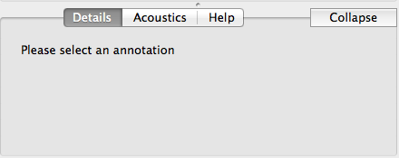

.. _tour:

*****************
Navigation Tour
*****************

This is a tour to get you familiarized with the SCT layout and its functions. 

Queries
#######
In the upper left corner, you will find the query panel

.. image:: query.png
		:width: 1058px
		:align: center
		:height: 408px
		:alt: Image cannot be displayed in your browser

You will begin by selecting a target type in the dropdown menu next to "Lingustic objects to find". 
You can add filters by pressing the long "+" bar at the bottom of the panel.
If you want to used a saved query, you can do so by selecting it from the dropdown menu on the top right of the panel.

Running, exporting, and saving a query are all done using the respective buttons along the bottom of the panel.

Discourse
#########

The discourse panel shows the waveform and spectrogram views of the audio for a given file (if there is audio) as well as an overlayed text-grid. 

Details/Acoustics/Help
########

This panel will give you details about your file, as well as precise acoustic information and help with queries

Connection
##########

This panel is used to establish connections with databases and import corpora from local folders.

.. image:: connection.png
		:width: 602px
		:align: center
		:height: 714px
		:alt: Image cannot be displayed in your browser