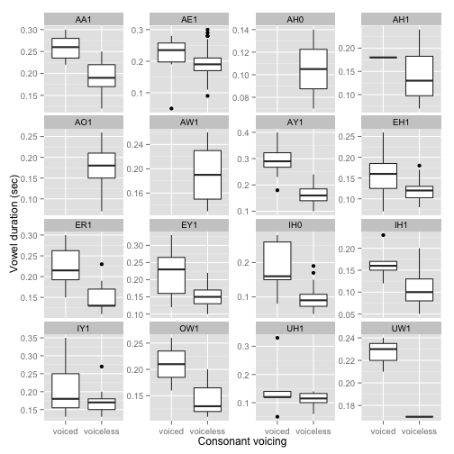
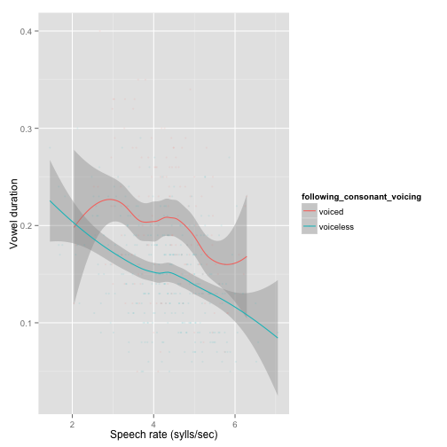
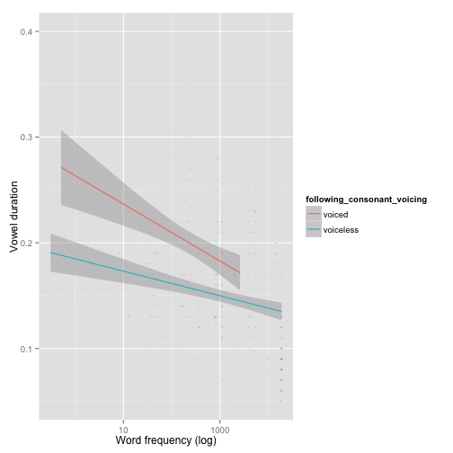
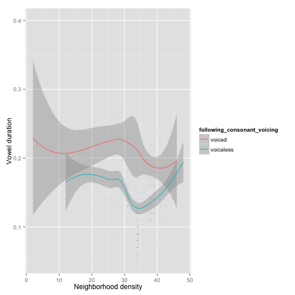

In R: **load the data file**:

::

    cvc <- read.csv("librispeechCvc.txt")

**Voicing**

A plot of the basic voicing effect, by vowel:

::

    ggplot(aes(x=following_consonant_voicing, y=vowel_duration), data=cvc) + geom_boxplot() + 
    facet_wrap(~vowel, scales = "free_y") + xlab("Consonant voicing") + ylab("Vowel duration (sec)") 

    

It looks like there is generally an effect in the expected direction, but the size of the effect may differ by vowel.

**Speech rate**

A plot of the basic speech rate effect, divided up by consonant voicing:

::

    ggplot(aes(x=speech_rate, y=vowel_duration), data=cvc) +
     geom_smooth(aes(color=following_consonant_voicing)) + 
    geom_point(aes(color=following_consonant_voicing), alpha=0.1, size=1) +
     xlab("Speech rate (sylls/sec)") + ylab("Vowel duration")

    

There is a large (and apparently nonlinear) speech rate effect. The size of the voicing effect is small compared to speech rate, and the voicing effect may be modulated by speech rate.

**Frequency**

A plot of the basic frequency effect, divided up by consonant voicing:

::

    ggplot(aes(x=word_frequency, y=vowel_duration), data=cvc) + 
    geom_smooth(aes(color=following_consonant_voicing), method="lm") + 
    geom_point(aes(color=following_consonant_voicing), alpha=0.1, size=1) +
     xlab("Word frequency (log)") + ylab("Vowel duration") + scale_x_log10()

    

(Note that we have forced a linear trend here, to make the effect clearer given the presence of more tokens for more frequent words. This turns out to be what the "real" effect looks like, once token frequency is accounted for.)

The basic frequency effect is as expected: shorter duration for higher frequency words. The voicing effect is (again) small in comparison, and may be modulated by word frequency: more frequent words (more reduced?) show a smaller effect.

**Neighborhood density**

In contrast, there is no clear effect of neighborhood density:

::

    ggplot(aes(x=word_neighborhood_density, y=vowel_duration), data=cvc) + 
    geom_smooth(aes(color=following_consonant_voicing)) + 
    geom_point(aes(color=following_consonant_voicing), alpha=0.1, size=1) + 
    xlab("Neighborhood density") + ylab("Vowel duration")

    

This turns out to be not unexpected, given previous work: while word duration and vowel quality (e.g., centralization) depend on neighborhood density (e.g. Gahl & Yao, 2011), vowel *duration* has not been consistently found to depend on neighborhood density (e.g. Munson, 2007).

