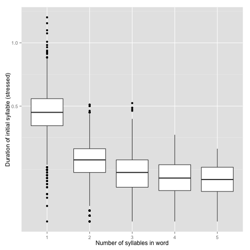
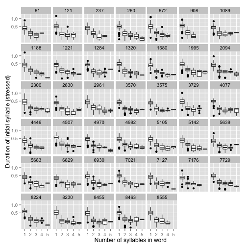

::

    cvc <- read.csv("librispeechCvc.txt")

In R: **load in the data**:

::

    pss <- read.csv("polysyllabic.csv")

There are very few words with 6 syllables:

::

    library(dplyr)
    group_by(pss, word_num_syllables) %>% summarise(n_distinct(word))

::

    ## Source: local data frame [6 x 2]
    ## 
    ##   word_num_syllables n_distinct(word)
    ##                (int)            (int)
    ## 1                  1             1019
    ## 2                  2             1165
    ## 3                  3              612
    ## 4                  4              240
    ## 5                  5               60
    ## 6                  6                7

So let's just exclude words with 6+ syllables:

::

    pss <- subset(pss, word_num_syllables<6)

Plot of the duration of the initial stressed syllable as a function of word duration (in syllables):

::

    library(ggplot2)
    ggplot(aes(x=factor(word_num_syllables), y=syllable_duration), data=pss) + 
    geom_boxplot() + xlab("Number of syllables in word") + 
    ylab("Duration of initial syllable (stressed)") + scale_y_sqrt()

    

Here we see a clear polysyllabic shortening effect from 1 to 2 syllables, and possibly one from 2 to 3 and 3 to 4 syllables.

This plot suggests that the effect is pretty robust across speakers (at least for 1--3 syllables):

::

    ggplot(aes(x=factor(word_num_syllables), y=syllable_duration), data=pss) + 
    geom_boxplot() + xlab("Number of syllables in word") + 
    ylab("Duration of initial syllable (stressed)") + scale_y_sqrt() + facet_wrap(~speaker)

    

